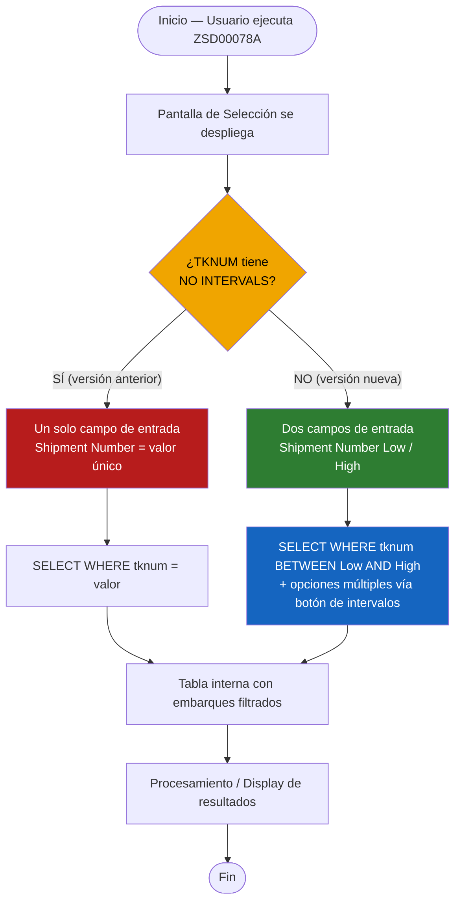
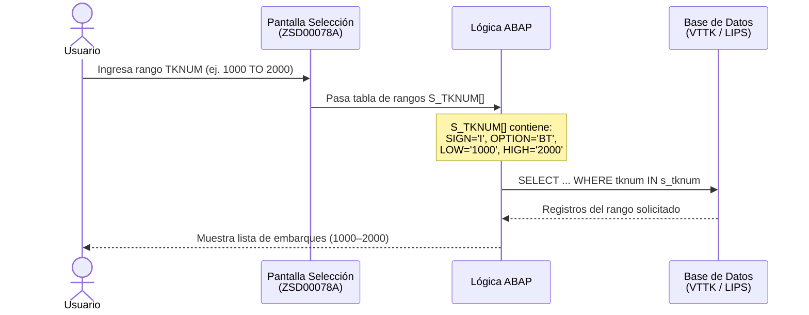

# Documentación de Cambio Técnico
## Programa: ZSD00078A — Ajuste de Parámetro TKNUM a Intervalo

---

## 1. Información General del Cambio

| Campo            | Detalle                                      |
|------------------|----------------------------------------------|
| **Programa**     | ZSD00078A                                    |
| **SR / Ticket**  | SR 415827                                    |
| **Usuario**      | CRISTOBALC                                   |
| **Fecha**        | 06/02/2026                                   |
| **Descripción**  | Adjust Parameter TKNUM to field with intervals |
| **Objeto ABAP**  | Reporte (PROG)                               |
| **Include afectado** | ZSD00078A_TOP (datos globales)           |

---

## 2. Descripción del Cambio

### 2.1 Antecedentes

El programa **ZSD00078A** es un monitor de planificación de embarques (*Shipment Planning Monitor*). En su versión original, el campo **Shipment Number (TKNUM)** de la pantalla de selección estaba definido como `SELECT-OPTIONS` con la restricción `NO INTERVALS`, lo que impedía al usuario ingresar un rango de números de embarque. Esto obligaba a filtrar embarque por embarque de forma individual.

### 2.2 Solicitud

Se solicitó mediante la SR 415827 habilitar la búsqueda por **intervalo** en el campo Shipment Number, de modo que el usuario pueda especificar un rango (valor *Desde* / *Hasta*) para consultar múltiples embarques en una sola ejecución.

### 2.3 Solución Implementada

Se eliminó la restricción `NO INTERVALS` de la declaración `SELECT-OPTIONS` para el campo `tknum` (tabla `vttk`), permitiendo así la captura de un valor inferior (*Low*) y un valor superior (*High*) en pantalla.

---

## 3. Detalle Técnico del Cambio

### 3.1 Código Antes del Cambio

```abap
*& SR    USER        Date        Change
*& 415827 CRISTOBALC 06/02/2026  Adjust Parameter TKNUM to field with intervals

SELECTION-SCREEN BEGIN OF BLOCK bl1 WITH FRAME TITLE text-s01.

  *SELECT-OPTIONS: tknum FOR vttk-tknum NO INTERVALS NO-EXTENSION,  "Shipment Number
                  vgbel FOR lips-vgbel NO INTERVALS NO-EXTENSION,   "Sales Order
                  vgpos FOR lips-vgpos NO INTERVALS NO-EXTENSION,   "Sales Order Item
                  dpreg FOR vttk-dpreg DEFAULT sy-datum,            "Delivery Date
                  shtyp FOR vttk-shtyp,                             "Ship Type
                  sortl FOR zcustcode-sortl MATCHCODE OBJECT zcuscod
                        NO INTERVALS NO-EXTENSION.                  "Customer Code

SELECTION-SCREEN END OF BLOCK bl1.
```

### 3.2 Código Después del Cambio

```abap
*& SR    USER        Date        Change
*& 415827 CRISTOBALC 06/02/2026  Adjust Parameter TKNUM to field with intervals

SELECTION-SCREEN BEGIN OF BLOCK bl1 WITH FRAME TITLE text-s01.

  SELECT-OPTIONS: tknum FOR vttk-tknum,                             "Shipment Number  ← CAMBIADO
                  vgbel FOR lips-vgbel NO INTERVALS NO-EXTENSION,   "Sales Order
                  vgpos FOR lips-vgpos NO INTERVALS NO-EXTENSION,   "Sales Order Item
                  dpreg FOR vttk-dpreg DEFAULT sy-datum,            "Delivery Date
                  shtyp FOR vttk-shtyp,                             "Ship Type
                  sortl FOR zcustcode-sortl MATCHCODE OBJECT zcuscod
                        NO INTERVALS NO-EXTENSION.                  "Customer Code

SELECTION-SCREEN END OF BLOCK bl1.
```

### 3.3 Resumen del Delta

| Línea | Antes | Después | Impacto |
|-------|-------|---------|---------|
| `tknum` | `SELECT-OPTIONS … NO INTERVALS NO-EXTENSION` | `SELECT-OPTIONS … tknum FOR vttk-tknum` | Habilita rango Low/High y botón de búsqueda avanzada |

> **Nota:** Al eliminar `NO INTERVALS` el sistema renderiza automáticamente dos campos de entrada (*Low* y *High*) y habilita la opción de selecciones múltiples mediante el botón de intervalos de la pantalla de selección estándar SAP.

---

## 4. Comparativa Visual de Pantalla

### Antes — TKNUM sin intervalo

```
┌─────────────────────────────────────────────────────────────┐
│  Selection Criteria                                         │
│  ┌───────────────────────────────────────────────────────┐  │
│  │ Shipment Number  │ [__________] [🔍]                  │  │
│  │ Sales Order      │ [______]                           │  │
│  │ Sales Order Item │ [______]                           │  │
│  │ Planned Del. Date│ [06/02/2026]  to  [__________] 📅 │  │
│  │ Shipment Type    │ [____]        to  [____]       [🔍]│  │
│  │ Customer Code    │ [______]                           │  │
│  └───────────────────────────────────────────────────────┘  │
└─────────────────────────────────────────────────────────────┘
  → Solo permite UN número de embarque a la vez.
```

### Después — TKNUM con intervalo ✅

```
┌─────────────────────────────────────────────────────────────┐
│  Selection Criteria                                         │
│  ┌───────────────────────────────────────────────────────┐  │
│  │ Shipment Number  │ [__________]  to  [__________] [🔍]│  │  ← INTERVALO
│  │ Sales Order      │ [______]                           │  │
│  │ Sales Order Item │ [______]                           │  │
│  │ Planned Del. Date│ [06/03/2026]  to  [__________] 📅 │  │
│  │ Shipment Type    │ [____]        to  [____]       [🔍]│  │
│  │ Customer Code    │ [______]                           │  │
│  └───────────────────────────────────────────────────────┘  │
└─────────────────────────────────────────────────────────────┘
  → Permite rango desde/hasta Y selecciones múltiples.
```

---

## 5. Diagrama de Flujo del Cambio



---

## 6. Diagrama de Secuencia — Impacto en la Lógica de Selección



---

## 7. Estructura de la Tabla de Rangos (SELECT-OPTIONS)

Cuando el campo `tknum` se declara con `SELECT-OPTIONS`, SAP genera internamente una tabla de tipo `RANGES` con la siguiente estructura:

| Campo    | Tipo   | Descripción                                      | Ejemplo        |
|----------|--------|--------------------------------------------------|----------------|
| `SIGN`   | C(1)   | `I` = Incluir, `E` = Excluir                     | `I`            |
| `OPTION` | C(2)   | `EQ`=Igual, `BT`=Entre, `CP`=Contiene patrón... | `BT`           |
| `LOW`    | TKNUM  | Valor inferior del intervalo                     | `0000001000`   |
| `HIGH`   | TKNUM  | Valor superior del intervalo                     | `0000002000`   |

---

## 8. Tablas SAP Involucradas

| Tabla        | Descripción                        | Campo clave usado |
|--------------|------------------------------------|-------------------|
| `VTTK`       | Cabecera de Embarque               | `TKNUM` (Nº de embarque) |
| `VTTP`       | Posiciones de Embarque             | `TKNUM`, `VBELN` |
| `LIPS`       | Posiciones de Entrega              | `VBELN`, `POSNR` |
| `LIKP`       | Cabecera de Entrega                | `VBELN`, `LFDAT` (fecha entrega) |
| `KNA1`       | Datos Maestros de Cliente          | `KUNNR` |
| `ZCUSTCODE`  | Tabla Z de Códigos de Cliente      | `SORTL` |

---

## 9. Casos de Uso Habilitados con el Cambio

| # | Caso de Uso | Antes | Después |
|---|-------------|-------|---------|
| 1 | Consultar un embarque específico | ✅ | ✅ |
| 2 | Consultar rango de embarques (ej. 1000–1500) | ❌ | ✅ |
| 3 | Excluir un número de embarque del resultado | ❌ | ✅ |
| 4 | Selecciones múltiples no contiguas | ❌ | ✅ |
| 5 | Dejar campo vacío (todos los embarques) | ✅ | ✅ |

---

## 10. Consideraciones y Riesgos

> **Rendimiento:** Al habilitarse el intervalo, una consulta sin límite en TKNUM puede retornar un volumen muy grande de registros. Se recomienda validar en la lógica del programa que el rango ingresado no supere un umbral configurable, o agregar un mensaje de advertencia al usuario.

> **Retrocompatibilidad:** El cambio es compatible hacia atrás. Los usuarios que antes ingresaban un solo valor ahora pueden seguir haciéndolo en el campo *Low*, dejando el campo *High* vacío.

> **Testing requerido:** Verificar el comportamiento de la consulta SQL en el programa cuando `s_tknum` contiene múltiples rangos con `SIGN = 'E'` (exclusiones).

---

## 11. Aprobaciones y Control de Cambios

| Rol                  | Nombre       | Fecha      | Firma |
|----------------------|--------------|------------|-------|
| Desarrollador        | CRISTOBALC   | 06/02/2026 |       |
| Revisor Técnico      |              |            |       |
| Responsable Funcional|              |            |       |
| Aprobador / Release  |              |            |       |

---

*Documento generado el 03/06/2026 — Proyecto ABAPCloud*
