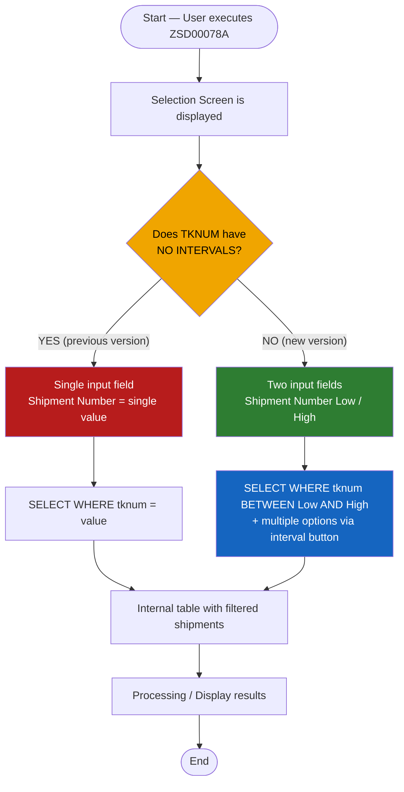
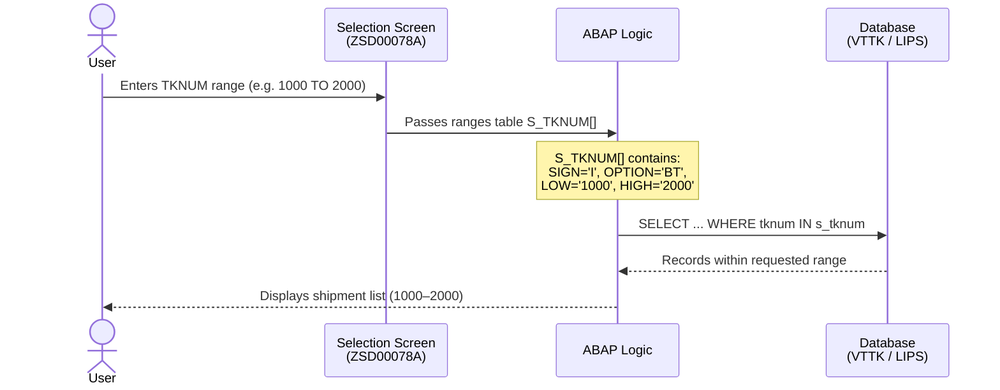

# Technical Change Documentation
## Program: ZSD00078A — TKNUM Parameter Adjusted to Interval Field

---

## 1. General Change Information

| Field             | Detail                                         |
|-------------------|------------------------------------------------|
| **Program**       | ZSD00078A                                      |
| **SR / Ticket**   | SR 415827                                      |
| **User**          | CRISTOBALC                                     |
| **Date**          | 06/02/2026                                     |
| **Description**   | Adjust Parameter TKNUM to field with intervals |
| **ABAP Object**   | Report (PROG)                                  |
| **Affected Include** | ZSD00078A_TOP (Global Data)               |

---

## 2. Change Description

### 2.1 Background

The program **ZSD00078A** is a Shipment Planning Monitor. In its original version, the **Shipment Number (TKNUM)** field on the selection screen was defined as a `SELECT-OPTIONS` with the `NO INTERVALS` restriction, which prevented users from entering a range of shipment numbers. This forced users to filter shipment by shipment individually.

### 2.2 Request

SR 415827 requested enabling **interval-based** search on the Shipment Number field, so that users can specify a range (*From* / *To*) to query multiple shipments in a single execution.

### 2.3 Implemented Solution

The `NO INTERVALS` restriction was removed from the `SELECT-OPTIONS` declaration for the `tknum` field (table `vttk`), thus allowing the entry of a lower (*Low*) and upper (*High*) value on screen.

---

## 3. Technical Change Detail

### 3.1 Code Before the Change

```abap
*& SR    USER        Date        Change
*& 415827 CRISTOBALC 06/02/2026  Adjust Parameter TKNUM to field with intervals

SELECTION-SCREEN BEGIN OF BLOCK bl1 WITH FRAME TITLE text-s01.

  *SELECT-OPTIONS: tknum FOR vttk-tknum NO INTERVALS NO-EXTENSION,  "Shipment Number
                  vgbel FOR lips-vgbel NO INTERVALS NO-EXTENSION,   "Sales Order
                  vgpos FOR lips-vgpos NO INTERVALS NO-EXTENSION,   "Sales Order Item
                  dpreg FOR vttk-dpreg DEFAULT sy-datum,            "Delivery Date
                  shtyp FOR vttk-shtyp,                             "Ship Type
                  sortl FOR zcustcode-sortl MATCHCODE OBJECT zcuscod
                        NO INTERVALS NO-EXTENSION.                  "Customer Code

SELECTION-SCREEN END OF BLOCK bl1.
```

### 3.2 Code After the Change

```abap
*& SR    USER        Date        Change
*& 415827 CRISTOBALC 06/02/2026  Adjust Parameter TKNUM to field with intervals

SELECTION-SCREEN BEGIN OF BLOCK bl1 WITH FRAME TITLE text-s01.

  SELECT-OPTIONS: tknum FOR vttk-tknum,                             "Shipment Number  ← CHANGED
                  vgbel FOR lips-vgbel NO INTERVALS NO-EXTENSION,   "Sales Order
                  vgpos FOR lips-vgpos NO INTERVALS NO-EXTENSION,   "Sales Order Item
                  dpreg FOR vttk-dpreg DEFAULT sy-datum,            "Delivery Date
                  shtyp FOR vttk-shtyp,                             "Ship Type
                  sortl FOR zcustcode-sortl MATCHCODE OBJECT zcuscod
                        NO INTERVALS NO-EXTENSION.                  "Customer Code

SELECTION-SCREEN END OF BLOCK bl1.
```

### 3.3 Change Delta Summary

| Line  | Before | After | Impact |
|-------|--------|-------|--------|
| `tknum` | `SELECT-OPTIONS … NO INTERVALS NO-EXTENSION` | `SELECT-OPTIONS … tknum FOR vttk-tknum` | Enables Low/High range and advanced search button |

> **Note:** By removing `NO INTERVALS`, SAP automatically renders two input fields (*Low* and *High*) and enables multiple-selection options via the standard SAP selection screen interval button.

---

## 4. Screen Visual Comparison

### Before — TKNUM without interval

```
┌─────────────────────────────────────────────────────────────┐
│  Selection Criteria                                         │
│  ┌───────────────────────────────────────────────────────┐  │
│  │ Shipment Number  │ [__________] [🔍]                  │  │
│  │ Sales Order      │ [______]                           │  │
│  │ Sales Order Item │ [______]                           │  │
│  │ Planned Del. Date│ [06/02/2026]  to  [__________] 📅 │  │
│  │ Shipment Type    │ [____]        to  [____]       [🔍]│  │
│  │ Customer Code    │ [______]                           │  │
│  └───────────────────────────────────────────────────────┘  │
└─────────────────────────────────────────────────────────────┘
  → Only allows ONE shipment number at a time.
```

### After — TKNUM with interval ✅

```
┌─────────────────────────────────────────────────────────────┐
│  Selection Criteria                                         │
│  ┌───────────────────────────────────────────────────────┐  │
│  │ Shipment Number  │ [__________]  to  [__________] [🔍]│  │  ← INTERVAL
│  │ Sales Order      │ [______]                           │  │
│  │ Sales Order Item │ [______]                           │  │
│  │ Planned Del. Date│ [06/03/2026]  to  [__________] 📅 │  │
│  │ Shipment Type    │ [____]        to  [____]       [🔍]│  │
│  │ Customer Code    │ [______]                           │  │
│  └───────────────────────────────────────────────────────┘  │
└─────────────────────────────────────────────────────────────┘
  → Allows From/To range AND multiple selections.
```

---

## 5. Change Flow Diagram



---

## 6. Sequence Diagram — Impact on Selection Logic



---

## 7. Ranges Table Structure (SELECT-OPTIONS)

When the `tknum` field is declared with `SELECT-OPTIONS`, SAP internally generates a `RANGES`-type table with the following structure:

| Field    | Type   | Description                                        | Example        |
|----------|--------|----------------------------------------------------|----------------|
| `SIGN`   | C(1)   | `I` = Include, `E` = Exclude                       | `I`            |
| `OPTION` | C(2)   | `EQ`=Equal, `BT`=Between, `CP`=Contains pattern…  | `BT`           |
| `LOW`    | TKNUM  | Lower bound of the interval                        | `0000001000`   |
| `HIGH`   | TKNUM  | Upper bound of the interval                        | `0000002000`   |

---

## 8. Involved SAP Tables

| Table        | Description                        | Key field used |
|--------------|------------------------------------|----------------|
| `VTTK`       | Shipment Header                    | `TKNUM` (Shipment Number) |
| `VTTP`       | Shipment Items                     | `TKNUM`, `VBELN` |
| `LIPS`       | Delivery Items                     | `VBELN`, `POSNR` |
| `LIKP`       | Delivery Header                    | `VBELN`, `LFDAT` (Delivery Date) |
| `KNA1`       | Customer Master Data               | `KUNNR` |
| `ZCUSTCODE`  | Custom Customer Code Table         | `SORTL` |

---

## 9. Use Cases Enabled by the Change

| # | Use Case | Before | After |
|---|----------|--------|-------|
| 1 | Query a specific shipment number | ✅ | ✅ |
| 2 | Query a range of shipments (e.g. 1000–1500) | ❌ | ✅ |
| 3 | Exclude a shipment number from results | ❌ | ✅ |
| 4 | Multiple non-contiguous selections | ❌ | ✅ |
| 5 | Leave field empty (all shipments) | ✅ | ✅ |

---

## 10. Considerations and Risks

> **Performance:** With the interval enabled, a query without a TKNUM limit may return a very large volume of records. It is recommended to validate in the program logic that the entered range does not exceed a configurable threshold, or to add a warning message to the user.

> **Backward Compatibility:** The change is backward compatible. Users who previously entered a single value can still do so in the *Low* field, leaving the *High* field empty.

> **Testing Required:** Verify the SQL query behavior in the program when `s_tknum` contains multiple ranges with `SIGN = 'E'` (exclusions).

---

## 11. Approvals and Change Control

| Role                  | Name         | Date       | Signature |
|-----------------------|--------------|------------|-----------|
| Developer             | CRISTOBALC   | 06/02/2026 |           |
| Technical Reviewer    |              |            |           |
| Functional Owner      |              |            |           |
| Approver / Release    |              |            |           |

---

*Document generated on 06/03/2026 — ABAPCloud Project*
